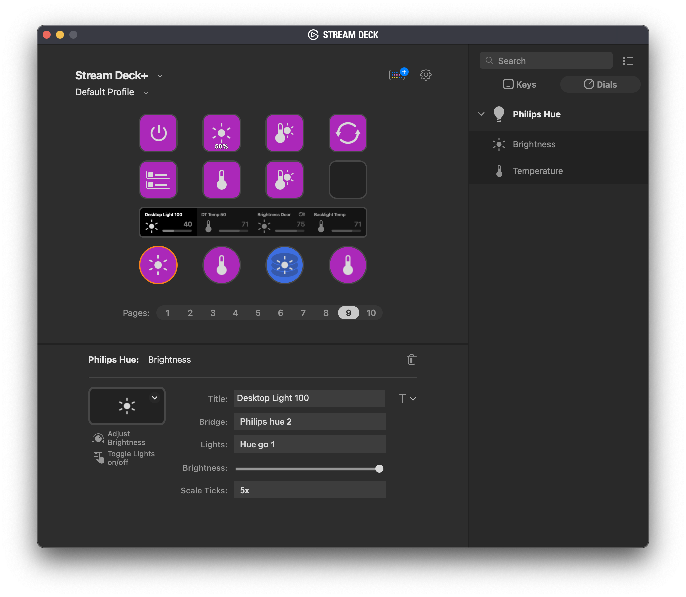

# Philips Hue Plugin for Elgato Stream Deck
This sample plugin allows controlling `Philips Hue` lights in your Network. It's a demonstration ot the [Stream Deck SDK](https://developer.elgato.com/documentation/stream-deck/).

# Features
- code written in JavaScript
- cross-platform (macOS, Windows)
- localized

# Installation
In the [Release](./Release) folder, you can find the file `com.elgato.philips-hue.streamDeckPlugin`. If you double-click this file on your machine, Stream Deck will install the plugin.

# Source code
The [Sources](./Sources) folder contains the source code of the plugin.
